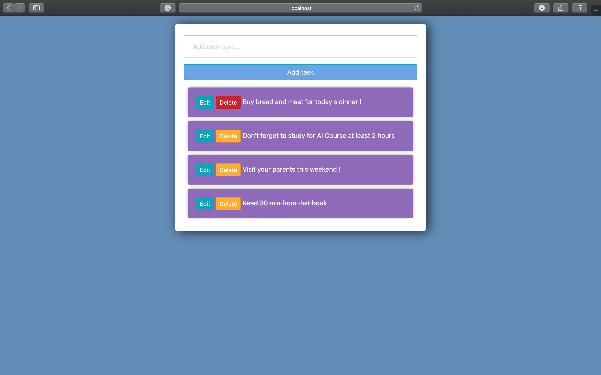
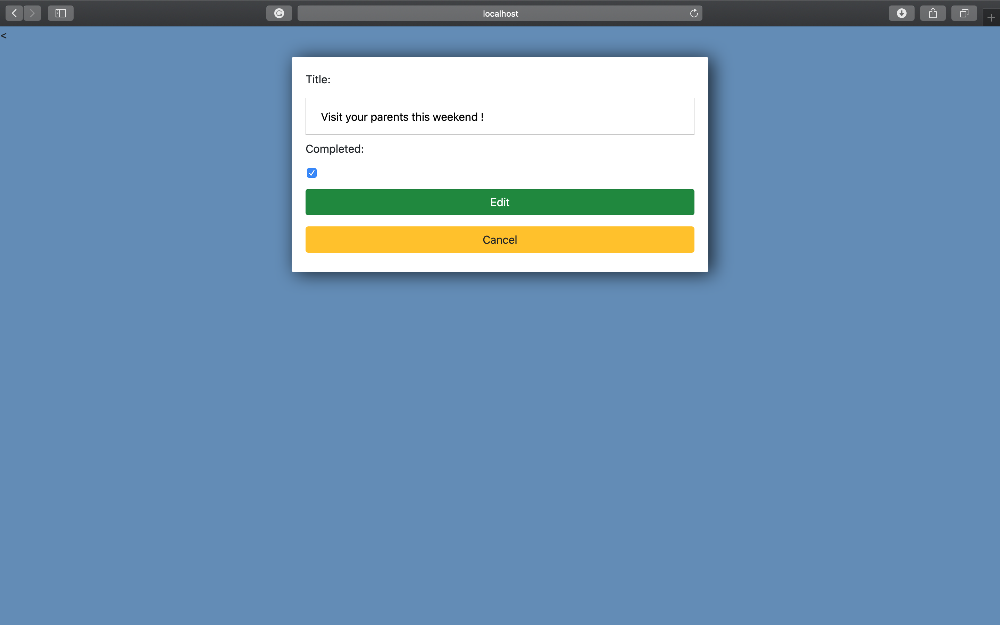

This is my personal To-Do web application which consists of python code for the backend and HTML/CSS for the frontend. 

The website is a very simple page with some stylesheet and some very cool features. On the index page, you have the possibility to add a new task, edit a task and mark it as completed if is it the case and if you don't want it anymore in your list you can delete it. 

Index-Page:

Update-Page:

